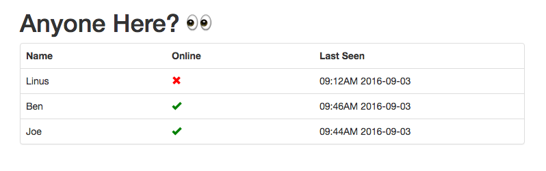

# AnyoneHere?
> :eyes: See who's home with a simple Flask API



## Installation

1. Clone repo and install dependencies

	```
	git clone https://github.com/bcongdon/AnyoneHere
	cd AnyoneHere
	pip install -r requirements.txt
	```

2. Copy template configuration file.

	```
	cp config-template.json config.json
	```

3. Edit `config.json` file to contain user names and MAC addresses.
4. Build the front end.
	```
	npm install
	npm run build
	```
5. Run AnyoneHere.

	```
	python run.py
	```
	
6. Connect to AnyoneHere at `http://localhost:5000`.
	* You can access online user data programmatically by sending a `GET` request to `/api/user`
